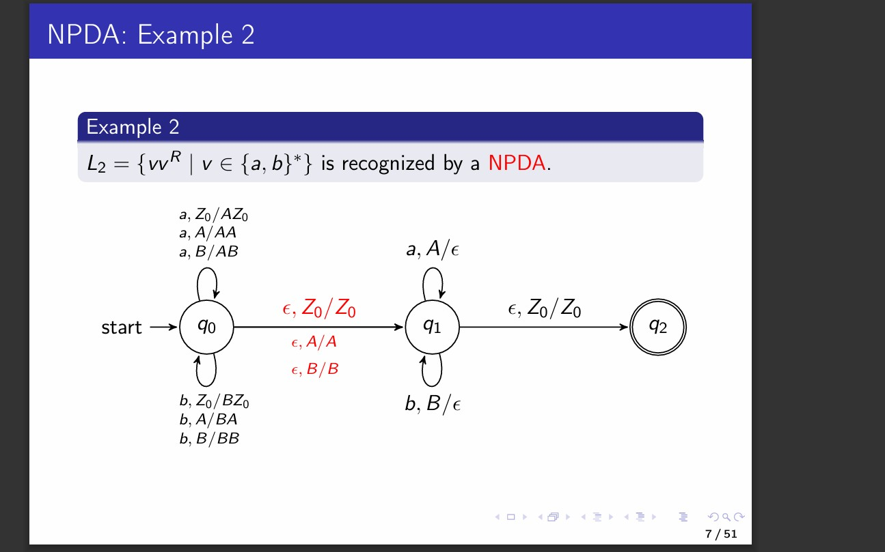
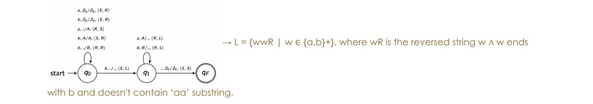

# NeuroSprint

Personal learning assistant for active recall, spaced repetition, and quiz generation from notes.

## Demo

### Screenshot 1: Dashboard and learning workspace



### Screenshot 2: Quiz session flow



## Product Context

### End users

- University students preparing for quizzes, midterms, and finals.
- Self-learners who want a lightweight study routine without external AI services.
- Instructors and teaching assistants who want students to review material consistently.

### Problem that the product solves

Students often keep notes but do not revisit them with a structured schedule. This causes low retention, cramming before deadlines, and weak understanding over time.

### Our solution

NeuroSprint turns notes into reusable question cards, schedules reviews with spaced repetition logic, and provides daily quiz sessions with analytics so users can study in short, consistent cycles.

## Features

### Implemented features

- User registration and login.
- Topic management and card management.
- Daily quiz sessions with answer checking.
- Progress metrics and forecast endpoints.
- Spaced Repetition Optimizer (study plan by available time windows).
- Insight notebook save and retrieval flow.
- Quiz generation from notes (local algorithm, no external API key required).

### Not yet implemented features

- Multi-user collaboration on shared topic sets.
- Export/import for cards in CSV/Anki formats.
- Mobile-first offline mode.
- Adaptive difficulty tuning based on long-term performance trends.

## Usage

1. Open the application in a browser.
2. Create an account and sign in.
3. Create a topic and add learning cards.
4. Optionally use "Generate Quiz" to create card drafts from your notes.
5. Start a quiz session and submit answers.
6. Review progress analytics and plan study blocks with spaced repetition.
7. Save key observations in the Insight notebook.

## Deployment

### VM operating system

- Ubuntu 24.04 LTS

### What should be installed on the VM

- Git
- Docker Engine
- Docker Compose plugin

Install prerequisites:

```bash
sudo apt update
sudo apt install -y git docker.io docker-compose-v2
sudo usermod -aG docker $USER
newgrp docker
```

### Step-by-step deployment instructions

1. Clone the repository:

```bash
git clone https://github.com/coldtime108/se-toolkit-hackathon.git
cd se-toolkit-hackathon
```

2. Build and start services:

```bash
docker compose up -d --build
```

3. Check that services are running:

```bash
docker compose ps
docker compose logs --tail=100
```

4. Open the product in browser:

- Local VM: `http://127.0.0.1:8000`
- University VM (example): `http://10.93.26.30:8000`

5. Stop services when needed:

```bash
docker compose down
```

## License

This project is open-source under the MIT License. See [LICENSE](LICENSE).
